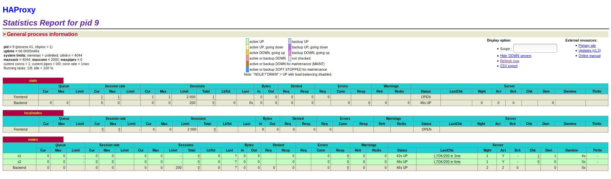
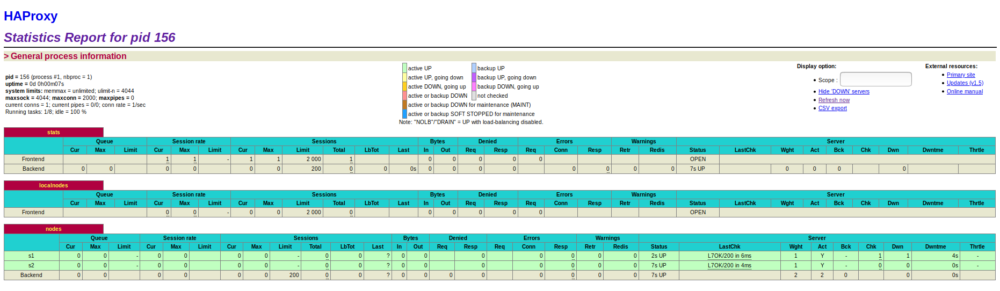

# Lab 04 - Docker

Authors: Mercier Jordan, Vogel Maximilian

Date: 18.12.2019

Forked from : https://github.com/SoftEng-HEIGVD/Teaching-HEIGVD-AIT-2019-Labo-Docker

# Table of content

0. [Introduction](#introduction)
1. [Identify issues and install the tools](#task-0)
2. [Add a process supervisor to run several processes](#task-1)
3. [Add a tool to manage membership in the web server cluster](#task-2)
4. [React to membership changes](#task-3)
5. [Use a template engine to easily generate configuration files](#task-4)
6. [Generate a new load balancer configuration when membership changes](#task-5)
7. [Make the load balancer automatically reload the new configuration](#task-6)
8. [Difficulties](#difficulties)
9. [Conclusion](#conclusion)

# Introduction

This lab builds on a previous lab on load balancing, evaluating what we did there and expanding on it.

# <a name="task-0"></a>Task 0 - Identify issues and install the tools

## Identify issues

Last lab's infrastructure (simple distributed system with a load balancer and two web applications):


[M1] Do you think we can use the current solution for a production environment? What are the main problems when deploying it in a production environment?

Sous la forme actuelle, la solution que nous avons mise en place n'est pas utilisable en production. Toutes les informations de serveur sont indiquées de manière statique, on n'a que 2 serveurs et un seul load balancer, ce qui veut dire que nous n'avons de loin pas assez de disponibilité pour une audience de plus qu'une poignée d'utilisateurs. De plus, chaque fois qu'on souhaite faire des changements, il faut éteindre les containers, changer les configs, puis finalement les relancer, ce qui n'est pas acceptable en production.

[M2] Describe what you need to do to add new `webapp` container to the infrastructure. Give the exact steps of what you have to do without modifiying the way the things are done. Hint: You probably have to modify some configuration and script files in a Docker image.

Pour chaque nouveau container d'application il faut ajouter un nouveau démarrage dans le script lançeant les images Docker avec une nouvelle combinaison nom/adresse IP valide. De plus, il faut indiquer toutes ces informations dans le fichier de configuration de HAProxy afin que ce dernier les prenne en compte.

[M3] Based on your previous answers, you have detected some issues in the current solution. Now propose a better approach at a high level.

Ce qu'on aimerait, ce serait une solution dynamique qui pourrait s'adapter au nombre d'utilisateurs courants, et qui géraient les crashs de containers. De plus, si on devrait pouvoir appliquer des changements sans redémarrer constamment tout le système.

[M4] You probably noticed that the list of web application nodes is hardcoded in the load balancer configuration. How can we manage the web app nodes in a more dynamic fashion?

Sous la forme actuelle il semble que les solutions possibles tournent toutes autour du fait d'annoncer plus de serveurs backend dans la config de HAProxy sous la forme de template ou alors carrément sous formes de serveurs nodes. On peut ensuite soit enable les serveurs (dans le cas de template servers disabled) ou alors lancer les serveurs décrits sous les nodes (avec Docker). Ces solutions semblent cependant peu rapides et pas très dynamiques : on découvra probablement des solutions adaptées au courant de ce laboratoire.

[M5] Do you think our current solution is able to run additional management processes beside the main web server / load balancer process in a container? If no, what is missing / required to reach the goal? If yes, how to proceed to run for example a log forwarding process?

Pour l'instant nos containers Docker ne supportent qu'un processus principal. Afin de gérer, par exemple, un tel système de forwarding des logs, il nous faudrait non seulement un container central responsable de ces logs, mais il faudrait également donner à nos machines Docker la capacité de gérer plusieurs processus, dont un pourrait forwarder des logs au container responsable.

[M6] What happens if we add more web server nodes? Do you think it is really dynamic? It's far away from being a dynamic configuration. Can you propose a solution to solve this?

Comme dit au point M4, ces ajouts de nodes server ne font de notre solution pas un système très dynamique. Ce que l'on fera probablement après avoir ajouté une fonctionnalité multi-processus à nos serveurs dockerisés, sera de profiter de ces outils pour communiquer des informations aux autres containers. On pourra utiliser ces informations de performances ou d'erreurs notamment pour qu'une autre machine (peut-être même la machine HAProxy) lance/kill de nouveaux serveurs en fonction de la charge de notre système. Un tel système serait effectivement dynamique.

## Install the tools : deliverables

1. Take a screenshot of the stats page of HAProxy at <http://192.168.42.42:1936>. You should see your backend nodes.



2. Repository URL : https://github.com/mercierjo/Teaching-HEIGVD-AIT-2019-Labo-Docker

# <a name="task-1"></a>Task 1: Add a process supervisor to run several processes

## Deliverables

1. Take a screenshot of the stats page of HAProxy at http://192.168.42.42:1936. You should see your backend nodes. It should be really similar to the screenshot of the previous task.



2. Describe your difficulties for this task and your understanding of what is happening during this task. Explain in your own words why we are installing a process supervisor. Do not hesitate to do more research and to find more articles on that topic to illustrate the problem.

    Comme on l'avait dit au point [M5], nos containers Docker ne supportent qu'un processus principal avant que l'on implémente ce point. Ce qu'on aimerait, c'est de pouvoir exécuter plusieurs tâches sur une même machine, afin de pouvoir communiquer des informations cruciales pour un système HA dynamique. Au lieu d'avoir un seul processus par container, on aurait une tâche par container, mais qui peut être composée de plusieurs processus.

    S6 permet de faire cela en remplaçant le processus principal de nos machines Docker par un processus de gestion d'autres processus, nous permettant d'effectuer plusieurs tâches sur un seul container.

# <a name="task-2"></a>Task 2: Add a tool to manage membership in the web server cluster

## Deliverables

1. Provide the docker log output for each of the containers: `ha`,
   `s1` and `s2`. You need to create a folder `logs` in your
   repository to store the files separately from the lab
   report. For each lab task create a folder and name it using the
   task number. No need to create a folder when there are no logs.

   Example:

   ```
   |-- root folder
     |-- logs
       |-- task 1
       |-- task 3
       |-- ...
   ```

2. Give the answer to the question about the existing problem with the current solution.

    Comme indiqué dans les remarques précédentes dans la donnée, notre load balancer ha risque de tomber, ou simplement de s'éteindre après que son UPTIME soit passé. Dans ce cas on se retrouve dans un cluster décentralisé, mais sans load balancer.
    
    Pour empêcher une telle situation on pourrait lancer plusieurs load balancer, pour qu'il y ait moins de risque qu'aucun load balancer soit up. De plus, ces containers sont maintenant capables de monitorer l'état des autres nodes et sont équipés de plusieurs processus potentiels. Ceci signifie que lorsqu'un de nos nodes tombe, on peut l'indiquer par un signal et potentiellement relancer un nouveau node pour le remplacer.

3. Give an explanation on how `Serf` is working. Read the official website to get more details about the `GOSSIP` protocol used in `Serf`. Try to find other solutions that can be used to solve similar situations where we need some auto-discovery mechanism.

    `Serf` fonctionne en lançant l'agent `Serf` sur chaque machine que l'on veut ajouter à notre cluster. Cet agent permet de communiquer des informations aux autres agents `Serf` dans le cluster ainsi que de recevoir celles des autres. A partir de ces infos, les machines en question peuvent effectuer des scripts spéciaux (`event handlers`) en réponse aux événements communiqués. Les événements auxquels l'agent réagit sont en général des changements à l'appartenance au cluster (machine offline ou online) mais peuvent également être des événement spécifiés ou des demandes.

    Afin d'effectuer ces communications, `Serf` utilise le protocole `Gossip` permettant de broadcast des messages aux autres nodes appartenant au cluster. Fondé sur `SWIM` (Scalable Weakly-consistent Infection-style Process Group Membership Protocol), ce protocole propage les informations d'appartenance de manière très efficace, optimisant ainsi l'utilisation du réseau.

# <a name="task-3"></a>Task 3: React to membership changes

## Deliverables

1. Provide the docker log output for each of the containers:  `ha`, `s1` and `s2`.
   Put your logs in the `logs` directory you created in the previous task.

2. Provide the logs from the `ha` container gathered directly from the `/var/log/serf.log`
   file present in the container. Put the logs in the `logs` directory in your repo.

# <a name="task-4"></a>Task 4: Use a template engine to easily generate configuration files

## Deliverables

1. You probably noticed when we added `xz-utils`, we have to rebuild
   the whole image which took some time. What can we do to mitigate
   that? Take a look at the Docker documentation on
   [image layers](https://docs.docker.com/engine/userguide/storagedriver/imagesandcontainers/#images-and-layers).
   Tell us about the pros and cons to merge as much as possible of the
   command. In other words, compare:

  ```
  RUN command 1
  RUN command 2
  RUN command 3
  ```

  vs.

  ```
  RUN command 1 && command 2 && command 3
  ```

    Chaque ligne de commande `RUN`, `COPY` et `ADD` dans le Dockerfile (depuis Docker 1.10) ajoute un layer à l'image que l'on construit, ce qui augmente la taille de cette dernière, mais réduit le temps de build également. Réduire le nombre de lignes permet donc de réduire la taille mais prolonge le temps de build.

  There are also some articles about techniques to reduce the image size. Try to find them. They are talking about `squashing` or `flattening` images.

    Un moyen de réduire la taille totale de nos images est d'utiliser une image de base aussi petite que possible (alpine et busbox ne font que 2MB/5MB). Il est également d'utiliser un tool tel que docker-squash permettant de réduire le nombre de layers en fusionnant certains layers, tout en maintenant l'utilité de chacun.

2. Propose a different approach to architecture our images to be able to reuse as much as possible what we have done. Your proposition should also try to avoid as much as possible repetitions between your images.

    Nos images se ressemblent largement : au lieu de créer deux images parallèles complètement déconnectées, on pourrait utiliser une base image `scratch` partagée par `haproxy` et `node` où l'on spécifie toutes les informations se chevauchant, construit cette image, puis avec deux Dockerfiles avec les indications séparant `webapp` de `ha` on indique comme image de base de ces deux nouvelles images l'image scratch que l'on vient de créer.

3. Provide the `/tmp/haproxy.cfg` file generated in the `ha` container after each step.  Place the output into the `logs` folder like you already did for the Docker logs in the previous tasks. Three files are expected.

    In addition, provide a log file containing the output of the `docker ps` console and another file (per container) with `docker inspect <container>`. Four files are expected.
   
4. Based on the three output files you have collected, what can you say about the way we generate it? What is the problem if any?

    Les outputs nous indiquent que 3 nodes sont correctement devenus membre de notre cluster. La méthode pour accéder à ce information n'est pas très rapide, mais notre load balancer y a accès.

# <a name="task-5"></a>Task 5: Generate a new load balancer configuration when membership changes

## Deliverables

1. Provide the file `/usr/local/etc/haproxy/haproxy.cfg` generated in
   the `ha` container after each step. Three files are expected.
   
   In addition, provide a log file containing the output of the 
   `docker ps` console and another file (per container) with
   `docker inspect <container>`. Four files are expected.

2. Provide the list of files from the `/nodes` folder inside the `ha` container.
   One file expected with the command output.

3. Provide the configuration file after you stopped one container and
   the list of nodes present in the `/nodes` folder. One file expected
   with the command output. Two files are expected.
   
    In addition, provide a log file containing the output of the 
   `docker ps` console. One file expected.

4. (Optional:) Propose a different approach to manage the list of backend
   nodes. You do not need to implement it. You can also propose your
   own tools or the ones you discovered online. In that case, do not
   forget to cite your references.

# <a name="task-6"></a>Task 6: Make the load balancer automatically reload the new configuration

## Deliverables

1. Take a screenshots of the HAProxy stat page showing more than 2 web
   applications running. Additional screenshots are welcome to see a
   sequence of experimentations like shutting down a node and starting
   more nodes.
   
   Also provide the output of `docker ps` in a log file. At least 
   one file is expected. You can provide one output per step of your
   experimentation according to your screenshots.
   
2. Give your own feelings about the final solution. Propose
   improvements or ways to do the things differently. If any, provide
   references to your readings for the improvements.

3. (Optional:) Present a live demo where you add and remove a backend container.